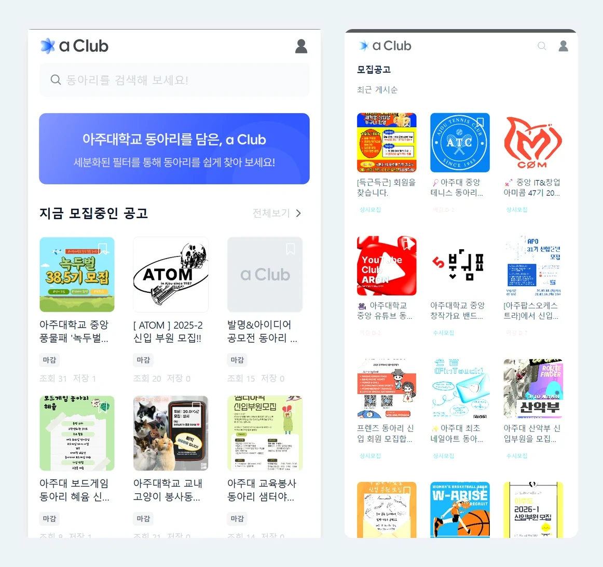
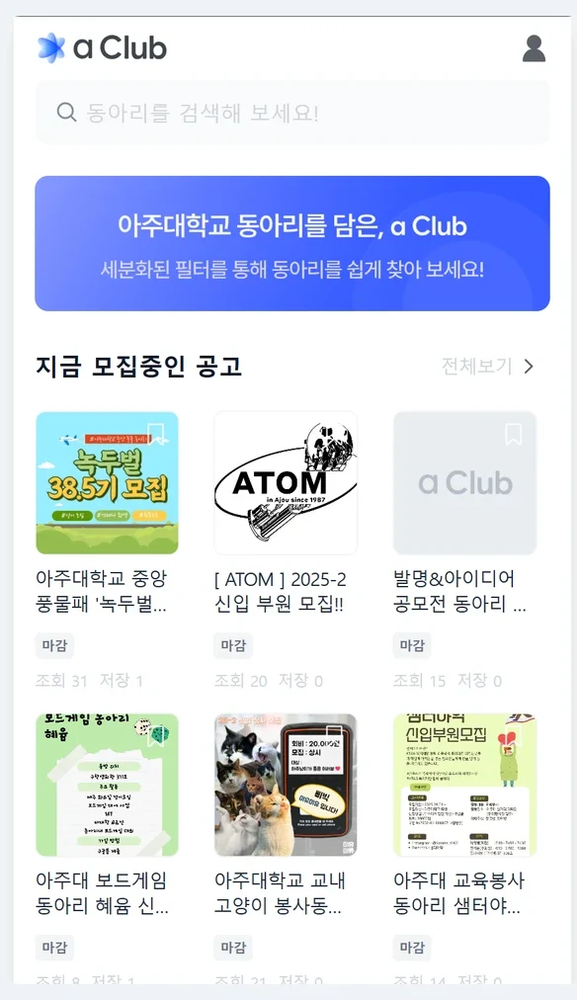
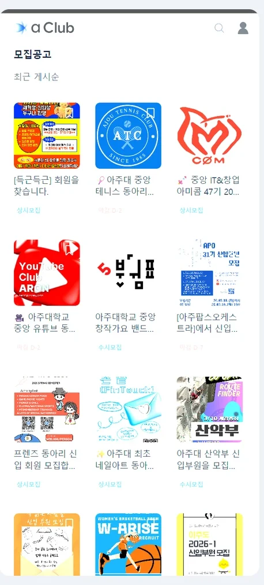
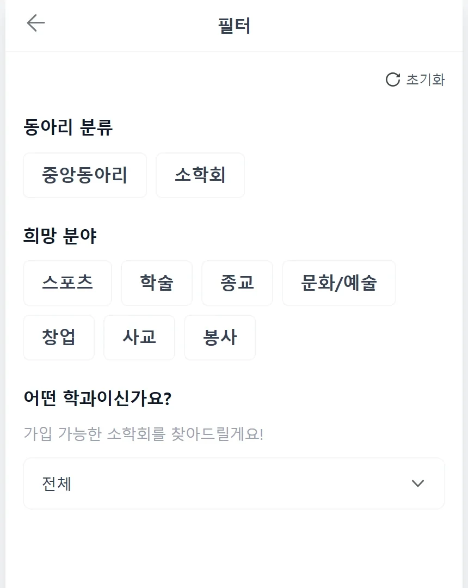
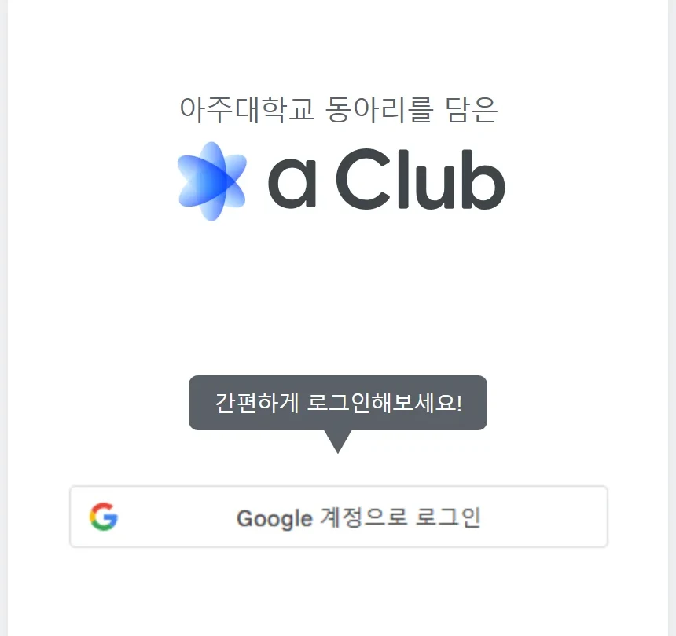
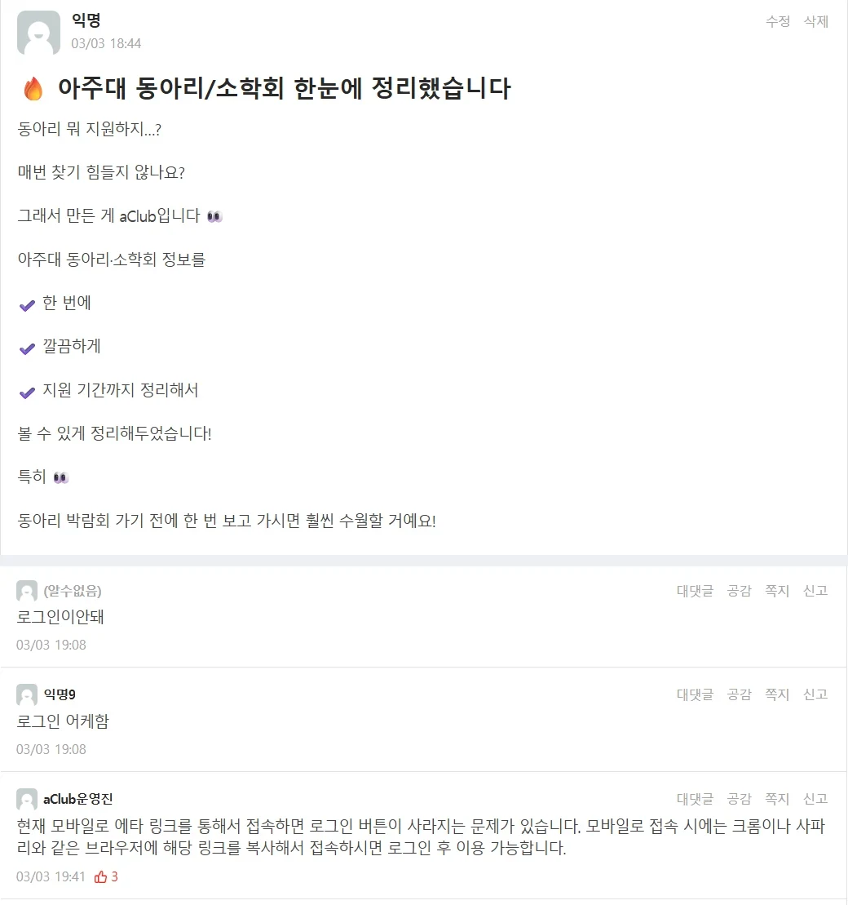
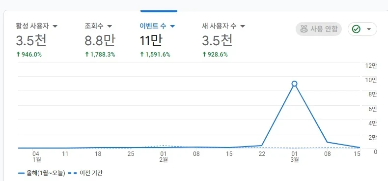
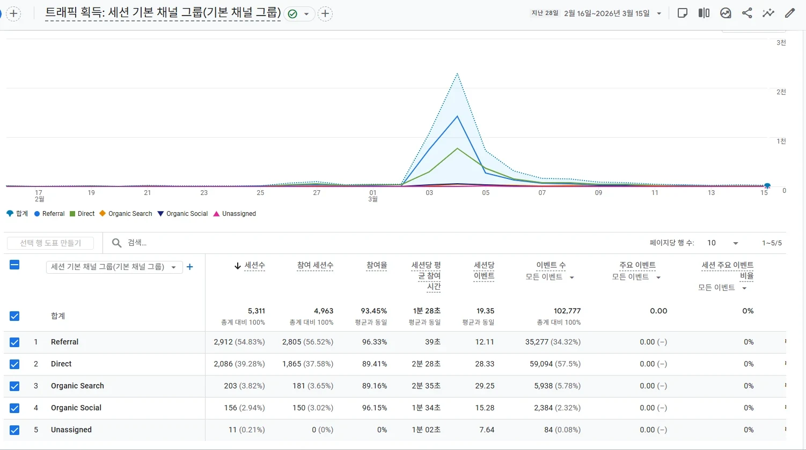
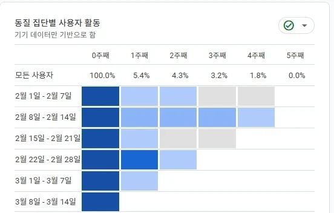

# aClub — 아주대 동아리 탐색·모집 (2026)

아주대학교 중앙동아리·소학회와 그 모집공고를 한 곳에 모은 모바일 웹. 학생은 에브리타임·인스타·단톡을 뒤지지 않고 여기서 찾아 지원하고, 동아리 운영진은 여기에 공고를 올린다. 2026년 3월 모집 시즌에 실제로 돌았다.



| | |
|---|---|
| 기간 | 2025.09 ~ 2026.03 (첫 커밋 2025-09-15, `main` 78 커밋). 내 커밋은 2026-01-19 ~ 2026-03-05 |
| 인원 | 4명 — 나는 **2026 프로젝트장**. `main` 78 커밋 중 내 커밋 22, 병합한 PR 3건 |
| 배포 | https://aclub.co.kr — GitHub Pages. 화면은 지금도 열리지만 **API 서버 도메인이 응답하지 않아 목록은 비어 있다**(2026-09-07 확인) |
| 전신 | 2025년 판이 [DBProject-24-2/DB_Project_FE](https://github.com/DBProject-24-2/DB_Project_FE). 같은 서비스를 CRA·데스크톱 웹에서 Vite·모바일 웹으로 다시 만든 것이 이 저장소다 |
| 백엔드 | [aClub2026/BE](https://github.com/aClub2026/BE) (Java). 이 저장소는 프론트만 있다 |

## 5분만 있다면

1. [`src/Hooks/useClubs.ts#L68-L84`](src/Hooks/useClubs.ts#L68-L84) — 서버 필터가 조합에 따라 실패해서, 실패하면 전체를 받아 클라이언트에서 같은 조건으로 거른다. 출시 두 시간 반 전에 넣은 임시 방편이고, 그 대가는 아래 「결정과 근거」에 적었다.
2. [`src/Hooks/useClubDetails.ts#L32-L47`](src/Hooks/useClubDetails.ts#L32-L47) — 중앙동아리와 소학회는 서로 다른 표라 id 가 겹친다. 목록에서 넘겨준 종류로 첫 요청에 맞는 엔드포인트를 고른다. 그 전에는 상세를 열 때마다 404 를 한 번 맞고 넘어갔다.
3. [`.github/workflows/deploy.yml#L56-L60`](.github/workflows/deploy.yml#L56-L60) — 다섯 줄짜리 알림 스텝 하나가 배포를 통째로 실패시키던 자리. 세 번 고쳐서 통과했다.

## 무엇이 돌아가나

| | |
|---|---|
|  |  |
| 첫 화면은 소개가 아니라 **지금 모집중인 공고**다. 그 아래가 동아리 둘러보기. 모집 기간이 끝난 공고는 홈에서 내린다. | 모집공고 목록. 썸네일은 공고 이미지 → 동아리 로고 → 기본 이미지 순으로 떨어진다. 칩이 상시모집·수시모집·마감 D-n 을 구분한다. |
|  |  |
| 검색이 아니라 필터로 좁힌다. 분류(중앙동아리·소학회) · 분야 7개 · 학과. 소학회는 학과가 곧 가입 자격이라 학과 선택이 따로 있다. | 로그인은 구글 하나. 학교 계정이 전부 구글이라 아이디·비밀번호를 따로 만들 이유가 없었다. |

이 밖에 동아리 검색·검색 결과, 동아리 상세(소개 · 모집공고 · 활동사진), 모집공고 상세와 지원 바, 마이페이지(저장한 공고 · 관리 중인 동아리), 자가진단, 그리고 운영진용 화면 세 개(동아리 정보 수정 · 동아리 소개 수정 · 모집공고 작성)가 있다. 페이지 15 · 컴포넌트 41 · 데이터 훅 7 · API 모듈 5(auth · club · logout · recruitment · user).

## 결정과 근거

### 서버 필터가 흔들려서, 필터를 클라이언트로 내렸다

출시 당일 오후, 동아리 목록 필터가 조합에 따라 간헐적으로 실패했다. 백엔드의 `/api/club/filter` 를 고치는 게 맞다. 그런데 그날 저녁 6시대에 에브리타임에 글을 올리기로 백엔드 담당과 날짜를 맞춰 둔 상태였고, 학생이 들어오는 기간은 3월 첫 주뿐이었다.

`/api/club/filter` 가 던지면 `/api/club/all` 로 전체를 받아 **클라이언트에서 같은 조건으로 거른다**([`useClubs.ts#L68-L84`](src/Hooks/useClubs.ts#L68-L84), 같은 판정을 하는 `applyClientFilters` 가 [`#L15-L28`](src/Hooks/useClubs.ts#L15-L28)에 있다). 같은 커밋에서 「모집 여부」 필터는 화면에서 아예 뺐다 — 서버와 클라이언트 판정이 어긋나는 게 그 항목이었고, 틀린 결과를 보여 주느니 없는 게 낫다고 봤다.

대가는 셋이다. 필터를 걸 때마다 동아리 전량을 받는다(2026년 3월 규모에서는 견디지만 커지면 못 버틴다), 서버 필터 버그는 그대로 남았다, 그리고 같은 조건 판정이 프론트와 백엔드 두 곳에 생겼다. 임시 방편인 걸 알고 넣었고, 아직 임시 방편이다.

### 「상시모집」과 「수시모집」이 전부 「상시모집」으로 찍혔다

모집 상태 칩이 `status`(`regular` | `d-day` | `end`) 하나만 받고 있었다. `status` 는 **마감일 계산 결과**다. 그런데 상시모집도 수시모집도 마감일이 없어 둘 다 `regular` 로 떨어졌고, 칩은 `regular` 를 보고 무조건 「상시모집」이라고 적었다. 수시모집으로 올린 동아리 화면에 상시모집이라고 쓰여 있었다.

원인은 버그라기보다 축을 하나로 본 것이었다. **모집 상태(기간이 얼마 남았나)와 모집 종류(상시냐 수시냐)는 다른 축**이다. `RecruitmentType` 을 목록·카드·상세 네 군데를 지나 칩까지 관통시키고, 칩은 `regular` 일 때 넘겨받은 종류를 그대로 적는다([`Chip_period.tsx#L44-L49`](src/components/ui/Chip/Chip_period.tsx#L44-L49)).

대가는 칩 한 줄 고치는 데 파일 8개를 건드렸다는 것이다. 상태만 받던 컴포넌트가 종류도 받게 되면서 그 네 화면의 props 가 다 늘었다.

### 배포가 계속 실패했는데, 실패한 건 배포가 아니었다

CI/CD 는 이미 팀원이 만들어 둔 상태였고(2025-11), 조직 저장소로 옮긴 뒤 워크플로가 계속 빨간불이었다. 세 가지가 겹쳐 있었다.

- `permissions: contents: write` 가 없어서 `gh-pages` 브랜치에 쓰지 못했다.
- 배포 검증 스텝이 옮기기 전 개인 계정 주소를 그대로 보고 있었다. 조직 주소로 바꿨다.
- **정작 배포는 성공하는데 워크플로는 실패했다.** 마지막 Discord 알림 스텝의 `if:` 가 `secrets` 컨텍스트를 직접 읽고 있었다. GitHub Actions 는 `if:` 에서 `secrets` 를 읽지 못한다.

셋째를 두 번 잘못 짚었다. 처음엔 `${{ }}` 로 감싸면 되는 줄 알았고(`f3453e9`), 아니어서 `env:` 로 한 번 받아 `env.DISCORD_WEBHOOK_URL` 을 비교하게 바꿨다(`31c4188`, [`deploy.yml#L56-L60`](.github/workflows/deploy.yml#L56-L60)). 그리고 검증 스텝에 `continue-on-error: true` 를 붙였다 — 알림이나 검증이 배포 결과를 뒤집으면 안 된다.

같은 무렵 `base` 도 `'/FE/'` 에서 `'/'` 로 되돌렸다. 저장소 이름이 아니라 커스텀 도메인 루트로 서비스하기 때문이다.

## 프로젝트장으로 한 것 — 출시 저녁

3월에 개편을 끝냈을 때, 사이트는 있는데 안이 비어 있었다. 모집공고는 동아리 회장이 올려야 생기고, 학생은 링크가 있어야 들어온다. 코드가 아니라 이 두 줄을 채우는 게 그때 할 일이었다.

동아리 회장들에게 직접 연락해 등록을 요청했고, 백엔드 담당과 출시 날짜를 맞췄다. 3월 3일 오후에 마지막 수정 두 건을 올리고(`470135d` 16:14, `003e655` 18:04), 사람이 몰리는 시간대에 에브리타임에 글을 올렸다(18:44).



올린 지 **24분 만에 「로그인이 안 돼」가 두 건** 달렸다. 에타 앱 안에서 링크를 열면 구글 로그인 버튼이 뜨지 않는 문제였다. 원인을 파는 대신 33분 뒤 운영진 댓글로 「크롬·사파리로 열어 달라」고 먼저 안내했다. 출시 저녁엔 고치는 것보다 쓰게 하는 게 먼저였다. 그날 저녁 등록을 요청했던 동아리 회장들의 답장이 이어졌다.

이틀 뒤인 3월 5일에는 카드에서 **조회수와 저장수를 뺐다**(`f73a66c`). 갓 열린 서비스라 「조회 15 · 저장 0」 같은 숫자가 붙어 있었는데, 그건 정보가 아니라 「아무도 안 봤다」는 신호로 읽힌다. 잃은 것도 있다 — 인기순 정렬이나 「많이 저장된 공고」 같은 걸 붙일 근거를 화면에서 지웠다.

## 잰 것 — Google Analytics 4

숫자는 GA4 화면에서 그대로 읽은 것이고, 창이 둘로 다르다.

| 지표 | 값 | 창 |
|---|---|---|
| 활성 사용자 | 3.5천 | 2026-01-01 ~ 03-15 누계 |
| 조회수 | 8.8만 | 2026-01-01 ~ 03-15 누계 |
| 세션 | 5,311 | 2026-02-16 ~ 03-15 (28일) |
| 참여율 | 93.45% | 같은 28일 |
| 세션당 평균 참여 시간 | 1분 28초 | 같은 28일 |



| | |
|---|---|
|  |  |
| 28일 세션 5,311건이 사실상 **3월 1~5일 닷새에 몰려** 있다. 유입은 Referral 54.83% + Direct 39.28% = 94%, 검색은 3.82%. 학생은 에타·인스타 링크를 타고 들어온다. | 1주 뒤 재방문 5.4%, 2주 4.3%, 4주 1.8%. |

낮은 재방문을 끌어올리는 대신 그대로 두기로 했다. 동아리 모집은 1년에 한 번이고, 학생은 동아리를 정하고 나면 돌아올 이유가 없다. **재방문 5.4% 는 실패가 아니라 이 서비스의 정상 상태**라고 보고, 목표를 「그 닷새 안에 원하는 동아리를 찾게 하는 것」으로 잡았다. 분야 카테고리를 쪼개 필터를 조합할 수 있게 한 게 그 결론이다.

효과 수치는 적지 않는다. 동아리 상세가 GA4 에서 제목 하나로 뭉쳐 잡혀 분포를 뽑을 수 없고, 개편 전 기간은 트래픽이 사실상 0이라 비교할 「전」이 없다.

## 알고 있는 빚

- **운영진 전용 화면의 권한 검사가 테스트하려고 풀어 둔 채로 남아 있다.** 되돌리는 것이 다음 순서고, API 를 다시 띄우기 전에 먼저 해야 할 일이다.
- 저장소의 `CNAME` 파일과 워크플로의 `cname:` 값이 **지금 서비스되는 주소가 아니다.** `gh-pages` 브랜치에만 맞는 값이 올라가 있어서, `main` 에서 다음 배포가 나가면 도메인이 그 값으로 덮인다.
- axios 클라이언트가 [`src/lib/axios.ts`](src/lib/axios.ts) 와 [`src/utils/axios.ts`](src/utils/axios.ts) 둘이다. 실제로 쓰이는 건 `utils` 쪽이고, `lib` 쪽 재발급 경로는 상대 주소라 배포본에서 API 가 아니라 Pages 로 간다.
- API 주소가 소스에 문자열로 박혀 있다. 환경변수가 아니다. 서버 주소가 바뀌면 코드를 고쳐 다시 배포해야 한다.
- 인앱 브라우저(에타·카카오톡)에서 구글 로그인 버튼이 뜨지 않는다. 출시 저녁엔 댓글 안내로 넘겼고, 코드로는 아직 안 고쳤다.
- [`src/main.tsx#L22`](src/main.tsx#L22) 의 GA 초기화가 자리표시자 문자열이다. 실제 수집은 `index.html` 의 gtag 가 한다. `index.html` 의 Microsoft Clarity 스크립트도 자리표시자라 아무것도 보내지 않는다.
- 위의 서버 필터 폴백은 임시 방편이다. 고칠 곳은 백엔드다.
- 파일 이름에 공백이 들어간 컴포넌트가 있다(`Card_recruitment _listitem.tsx`). 고치려면 import 를 같이 옮겨야 해서 미뤄 뒀다.
- 자동화된 테스트가 없다. `npm run lint` 뿐이다.

## 실행하기

<details>
<summary>Node 20 · Vite 개발 서버 5173</summary>

```bash
npm ci
npm run dev      # http://localhost:5173
npm run build    # tsc -b && vite build → dist/
npm run lint
```

**환경변수는 없다.** API 주소(`src/lib/axios.ts`, `src/utils/axios.ts`)와 Google OAuth 클라이언트 ID(`src/main.tsx`)가 소스에 들어 있다. 다른 서버를 붙이려면 그 두 파일을 고친다. 위 「알고 있는 빚」에 적은 대로 이건 고쳐야 할 상태지 따라 할 본보기가 아니다.

배포는 `main` 에 push 하면 [`.github/workflows/deploy.yml`](.github/workflows/deploy.yml) 이 빌드해 `gh-pages` 브랜치로 올린다. `npm run deploy` 로 로컬에서도 올릴 수 있지만, 워크플로가 `cname` 을 같이 쓰므로 도메인이 어떤 값으로 덮이는지 확인하고 쓸 것.

</details>

<details>
<summary>폴더</summary>

```text
src/pages/       화면 15 — 홈 · 탐색 · 필터 · 검색 · 모집공고 · 상세 · 마이페이지 · admin/ 3
src/components/  common(카드·헤더·보호 라우트) · ui(버튼·칩·필드) · 화면별 조각
src/Hooks/       도메인별 데이터 훅 7 — useClubs · useClubDetails · useRecruitments …
src/api/         axios 호출 5 — auth · club · logout · recruitment · user
src/stores/      zustand — useAuthStore(로그인 상태·토큰)
src/types/       club · recruit · user
```

</details>

## 만든 사람

2026 팀 4명, GitHub 로그인 기준. 커밋 수는 `main` 기준이다.

| | |
|---|---|
| [@ejiyoon37](https://github.com/ejiyoon37) (41) | 2025년 9월 첫 커밋부터의 주 작성자. 화면 구조, 공통 컴포넌트, 데이터 훅, API 연동, 보호 라우트가 이 사람 손에서 나왔다. |
| [@toadsam](https://github.com/toadsam) (22) — 정재훈 | 2026 프로젝트장. 위 「결정과 근거」와 「출시 저녁」이 내 몫이다. 모집 필터·기간 표시·상세 진입 오류, 배포 워크플로 안정화, 회장 섭외와 출시 운영. |
| [@rryunn](https://github.com/rryunn) (14) | GitHub Pages CI/CD 구축(2025-11), 구글 애널리틱스 연동, 자가진단. 2025년 판 [DB_Project_FE](https://github.com/DBProject-24-2/DB_Project_FE) 의 주 작성자이기도 하다. |
| [@Choihyeongmin](https://github.com/Choihyeongmin) (1) | 라이선스 추가. 서비스 도메인 전환도 이 사람이 했다(`gh-pages`). |

정재훈 — 아주대학교. 다른 작업은 [포트폴리오 마을](https://jaehun.co.kr)과 [GitHub](https://github.com/toadsam) 에 있다.
